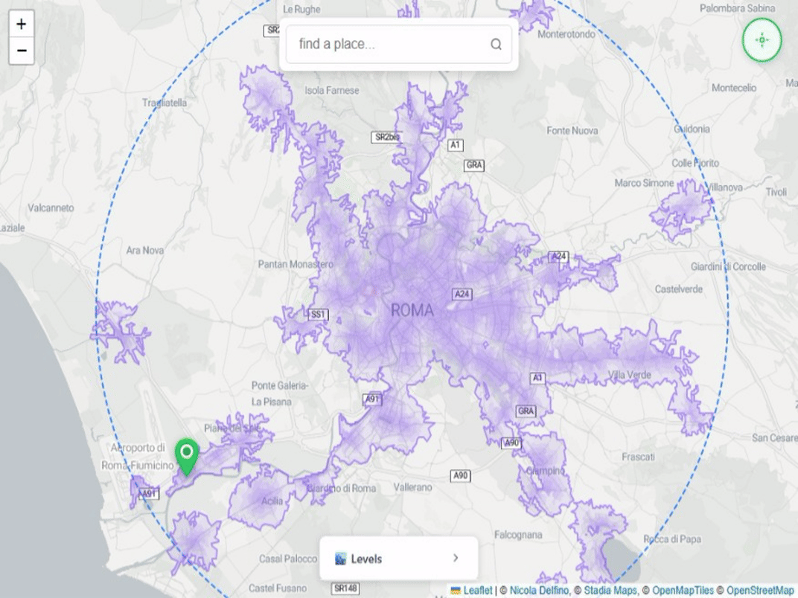

# The Proximity project

MetroProximity è un progetto open source che mira a fornire una mappa interattiva delle aree urbane accessibili a piedi dalle stazioni della metropolitana di Roma. L'obiettivo principale è aiutare le persone a trovare zone in cui è possibile vivere senza la necessità di un'auto, promuovendo uno stile di vita più sostenibile e riducendo l'impatto ambientale.

Questo progetto é stato ispirato da un post su reddit (https://www.reddit.com/r/roma/comments/1ib2ue7/mappa_di_roma_dentro_il_raccordo_indicando_in/), in cui un utente mostrava una mappa molto interessante che dava evidenza in ogni punto all'interno del raccordo anulare romano, di quale fosse la stazione della metro piú vicina. Grazie https://www.reddit.com/user/Piastrellista88/ :-)

## Caratteristiche

- **Mappa Interattiva**: Visualizza le aree che si trovano entro un raggio di 1 km da ogni stazione della metropolitana.
- **Facilità d'Uso**: Interfaccia intuitiva e user-friendly per una navigazione semplice e veloce.
- **Open Source**: Codice sorgente disponibile pubblicamente per consentire contributi e miglioramenti da parte della comunità.

## Perché questa mappa

- **Vita Sostenibile**: Promuove uno stile di vita senza auto, riducendo le emissioni di CO2 e l'inquinamento atmosferico.
- **Accessibilità**: Aiuta le persone a trovare abitazioni e servizi facilmente raggiungibili a piedi dalle stazioni della metropolitana.
- **Comunità**: Favorisce la creazione di comunità più coese e connesse, migliorando la qualità della vita urbana.
- **Contributi della Comunità**: Essendo un progetto open source, chiunque può contribuire con idee, codice e miglioramenti, rendendo MetroProximity un progetto in continua evoluzione.
